# Integração entre Microsserviços (API de Registro de Usuários e Atualização de Senhas com Spring Boot / Serviço de Mensageria com RabbitMQ)

Este projeto teve como objetivo desenvolver um microserviço para o registro de usuários e atualização de senhas utilizando Spring Boot. A aplicação implementa autenticação JWT, integração com a API ViaCEP para busca de endereço e utiliza RabbitMQ para enviar mensagens a um microserviço de mensageria ("notify").

## Funcionalidades

1. **Registro de Usuário**: Permite criar um novo usuário no sistema, buscando o endereço através do CEP informado.
2. **Atualização de Senha**: Permite que usuários atualizem sua senha após autenticação.
3. **Segurança com JWT**: Autenticação e autorização com tokens JWT.
4. **Mensageria com RabbitMQ**: Envia mensagens de notificação de criação e atualização para o microserviço "notify".

## Requisitos do Projeto

- **Spring Boot** para construção da API RESTful.
- **Spring Security** com autenticação e autorização baseada em JWT.
- **RabbitMQ** para comunicação assíncrona entre microserviços.
- **API ViaCEP** para integração de busca de endereço através do CEP.
- **Docker Compose** para configuração e execução dos containers.

## Endpoints

### Registro de Usuário

- **URL**: `POST /api/users/register`
- **Request Body**:
    ```json
    {
      "username": "string",
      "password": "string",
      "email": "string",
      "cep": "string"
    }
    ```
- **Response Body**:
    ```json
    {
      "username": "string",
      "email": "string",
      "address": {
        "zipCode": "12345678",
        "street": "Example Street",
        "complement": "Apt 101",
        "neighborhood": "Example Neighborhood",
        "city": "Example City",
        "state": "SP"
      }
    }
    ```

**Descrição**:
- A senha é criptografada antes de ser salva.
- A API busca o endereço completo pelo CEP fornecido na API ViaCEP e salva o usuário no banco de dados.

### Atualização de Senha

- **URL**: `PUT /api/users/update-password`
- **Request Body**:
    ```json
    {
      "username": "string",
      "oldPassword": "string",
      "newPassword": "string"
    }
    ```
- **Response**: Sem conteúdo de resposta (HTTP 204 No Content)

**Descrição**:
- A API valida a senha antiga e, caso correta, atualiza para a nova senha.

## Segurança com JWT

- A API utiliza **JWT** para autenticação e autorização de usuários.
- O endpoint `/api/users/register` é público e acessível sem autenticação.
- O endpoint `/api/users/update-password` é restrito a usuários autenticados.

## Sistema de Mensageria

A aplicação utiliza RabbitMQ para enviar mensagens ao microserviço "notify", que então processa as notificações de criação ou atualização de usuários.

- **Estrutura da Mensagem**:
    ```json
    {
      "username": "string",
      "operation": "CREATE" | "UPDATE",
      "timestamp": "string"
    }
    ```

### Microserviço notify

O microserviço "notify" é responsável por:

- Receber mensagens através do RabbitMQ.
- Processar mensagens com os campos `username`, `operation`, `timestamp`.
- Exibir a mensagem no console e armazená-la em um banco de dados MongoDB.

## Configuração do Ambiente

### Pré-requisitos

- **Docker e Docker Compose** para subir os serviços de container.
- **Maven** para gerar os arquivos .jar das aplicações de usuário e notify.

### Passo a Passo para Execução

1. Clone o repositório:
   ```bash
   git clone https://github.com/DevMatheusMarques/integration-between-microservices.git
   cd integration-between-microservices

2. Dentro da pasta acesse o terminal em cada microsserviço(usuário e notify) e rode o comando:
   ```bash
   mvn clean install -DskipTests
   ```
   Assim que os jar estiverem sido gerados, vá a pasta principal que agrupa todos microsserviços e use o comando:
   ```bash
   docker-compose up -d
   ```
   
3. Após executar o comando o Docker irá subir as imagens e containers da aplicação e então você poderá acessar os microsserviços e realizar as requisições desejadas.
   
   Exemplo com a aplicação front-end:

   Acesse no navegador a URL http://localhost:5173/auth e crie um usuário clicando na opção de cadastrar-se:

   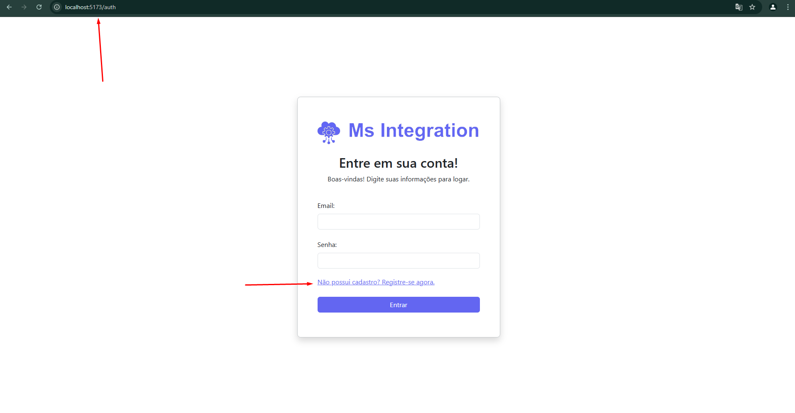

   Após concluir o cadastro basta acessar a tela de login e inserir o e-mail e senha do usuário criado e então você terá acesso a dashboard da aplicação onde poderá cadastrar um novo usuário ou alterar a senha do usuário que você logou:

   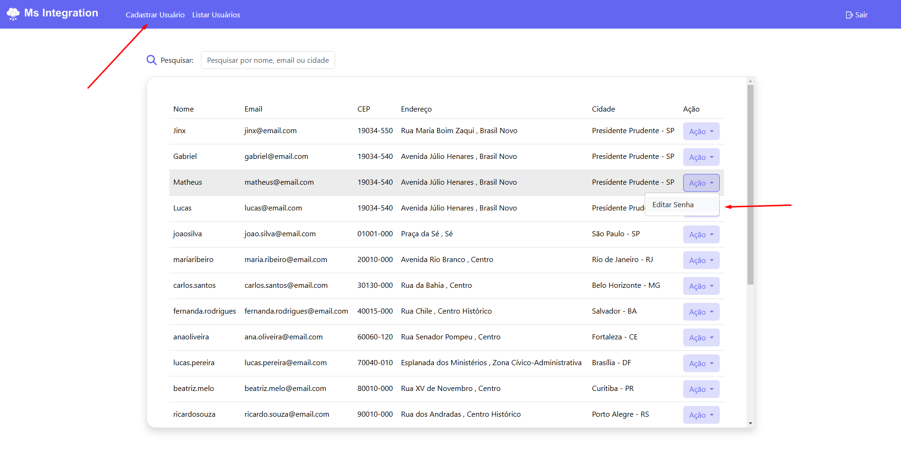

   Exemplo com a ferramenta Postaman:

   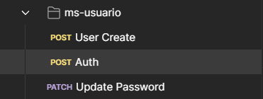

   Exemplo(Autenticação):

   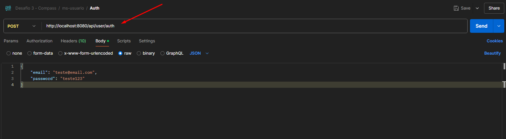

   Exemplo(Criação de Usuário):
   
   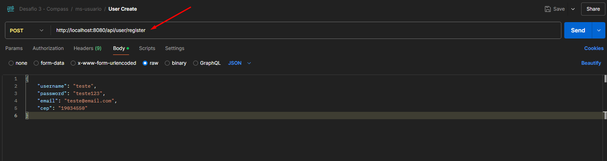

   Exemplo(Mudar Senha):

   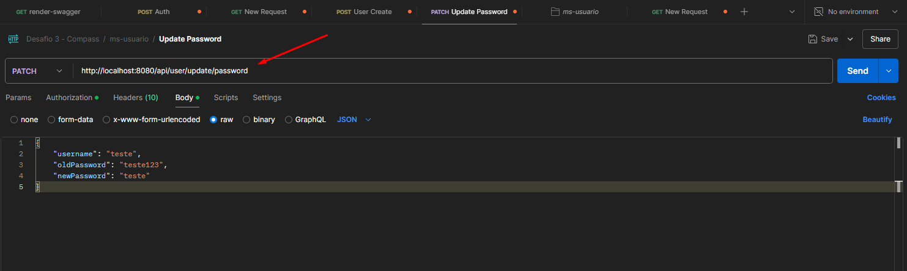

   Exemplo(Buscar Todos Usuários):

   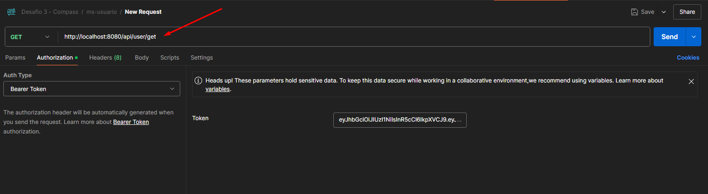

   Para utilizar as rotas de mudança de senha e buscar todos usuários, é necessário estar autenticado, então deve-se autenticar primeiro, pegar o token e armazena-lo para que ele vá junto com a requisição:

   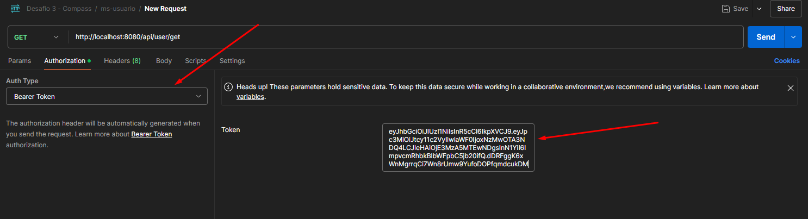

   Ao realizar uma requisição de criação de usuário ou alteração de senha, será mostrado um log no console da aplicação ms-notify e a mensagem será armazenada no banco de dados MongDB:


   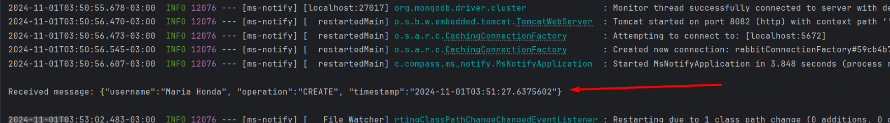

   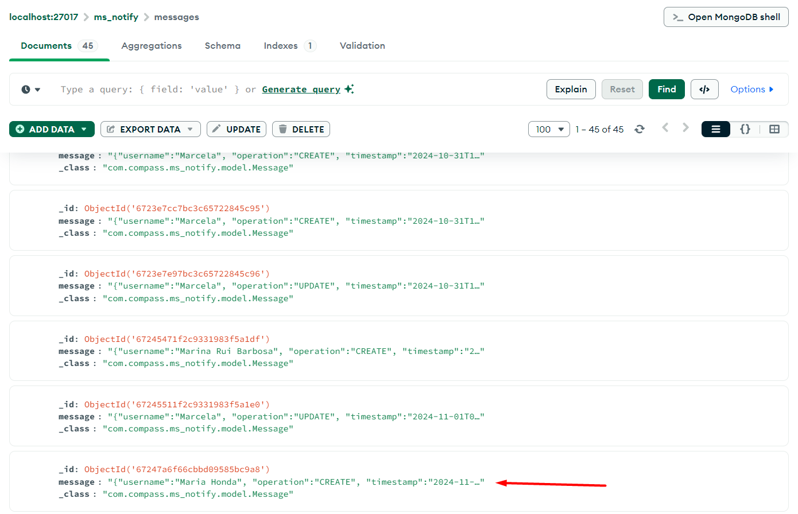
   
4. Acesse o Swagger para visualizar a documentação da API (opcional) através do arquivo swagger.yaml que se encontra na pasta ms-usuario:

   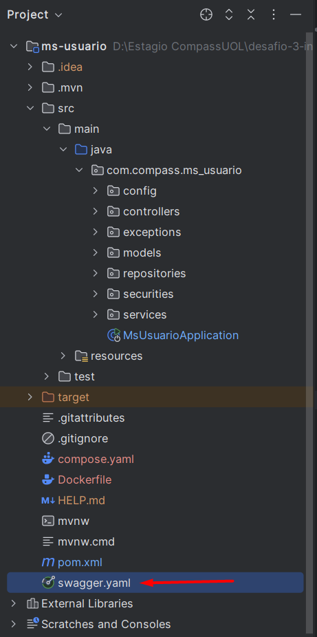

   Clique no arquivo e abra o mesmo. Copie seu conteúdo e coloque em um dos seguintes sites:
   
   - https://editor.swagger.io/  
   - https://editor-next.swagger.io/

   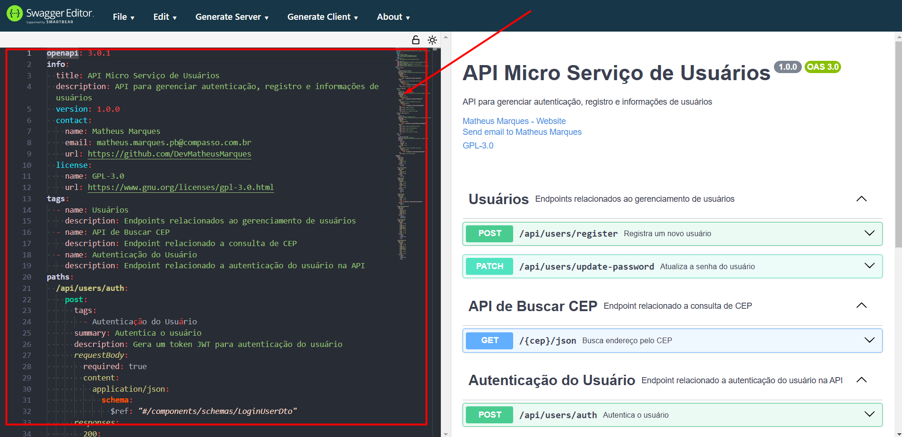

## Estrutura do Projeto (ms-usuario)

   ```bash
   src/
├── main/
│   ├── java/
│   │   ├── com/compass/ms_usuario/    # Pacote principal
│   │   ├── config/                    # Configurações de serviços utilizados
│   │   ├── controllers/               # Controladores REST
│   │   ├── exceptions/                # Tratamento personalizado de excessões
│   │   ├── models/dto/                # Modelos de dados (entidades) e DTO's para encapsulamento e simplificação os dados que precisam ser enviados e recebidos
│   │   ├── repositories/              # Repositórios para interação com o BD
│   │   ├── securities/                # Configurações de autenticação e JWT
│   │   ├── services/                  # Serviços de negócios e lógica
│   └── resources/
│       └── application.yml            # Configurações de aplicação
└── Dockerfile                         # Arquivo Docker para containerização
```


## Estrutura do Projeto (ms-notify)

   ```bash
   src/
├── main/
│   ├── java/
│   │   ├── com/compass/ms_notify/     # Pacote principal
│   │   ├── config/                    # Configurações de serviços utilizados
│   │   ├── models/                    # Modelos de dados (entidades)
│   │   ├── repositories/              # Repositórios para interação com o BD
│   │   ├── services/                  # Serviços de negócios e lógica
│   └── resources/
│       └── application.yml            # Configurações de aplicação
└── Dockerfile                         # Arquivo Docker para containerização
```

## Estrutura do Projeto (ms-frontend)

   ```bash
   src/
├── src/
│   ├── assets/                         # Pacote de imagens
│   ├── components/                     # Pacote de componentes
│   ├── Pages/                          # Pacote de páginas
│   ├── App.vue                         # Documento de renderização do vue
│   ├── main.js                         # Documento de configuração
│   └── style                           # Documento de configuração
│      
└── Dockerfile                         # Arquivo Docker para containerização
```

## Considerações Finais

Este projeto demonstra uma implementação básica de segurança, comunicação entre microsserviços e integração com serviços externos em uma API Spring Boot. Com essas tecnologias, é possível construir uma aplicação escalável, segura e modular, pronta para ser expandida com novos recursos.


### Contato
Em caso de dúvidas ou problemas, entre em contato com:

* Nome: Matheus Marques
* Email: matheus.marques.pb@compasso.com.br
* GitHub: https://github.com/DevMatheusMarques
